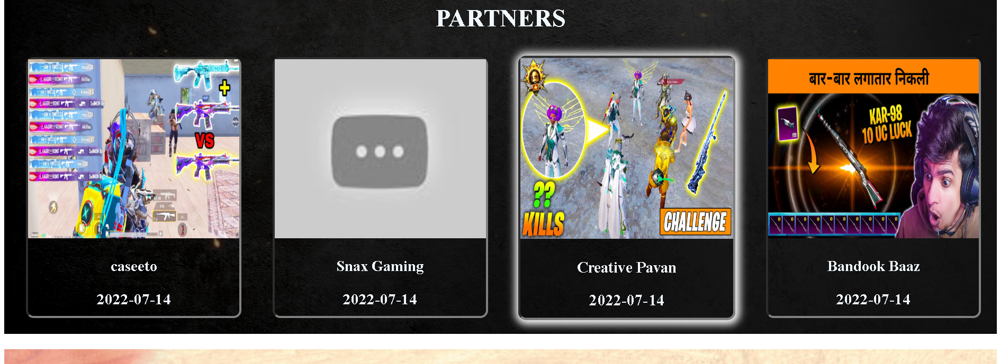

# 🎮 BGMI Clone Website (React Project)

This project is a **clone of the BGMI (Battlegrounds Mobile India) official website**, built using **React.js**. The main goal of this project is to practice **frontend development, UI design, responsiveness, and React component-based architecture**.

---

## 🚀 Features

* 🎯 Modern UI inspired by BGMI official website
* 📱 Fully **responsive design** (Mobile, Tablet & Desktop)
* 🖼️ Full-screen background images
* 📰 News & updates section
* 🤝 Partners section
* 🍔 Mobile-friendly **hamburger navigation menu**
* ⚡ Built with **React + CSS**

---

## 🛠️ Technologies Used

* **React.js**
* **JavaScript (ES6)**
* **HTML5**
* **CSS3**
* **Vite + React** 
* **Git & GitHub**

---

## 📂 Project Setup (Run Locally)

1. Clone the repository:

```bash
git clone https://github.com/Guptadeepak1915/Bgmi_Clone_Website.git
```

2. Go to project folder:

```bash
cd Bgmi_Clone_Website
```

3. Install dependencies:

```bash
npm install
```

4. Run the project:

```bash
npm start
```

or

```bash
npm run dev
```

5. Open in browser:

```
http://localhost:3000
```

or

```
http://localhost:5173
```

---

## 🎯 Purpose of the Project

This project is created for:

* Learning **React basics**
* Practicing **responsive web design**
* Understanding **component-based architecture**
* Improving **frontend development skills**

---

## 👨‍💻 Developer

**Deepak Gupta**
Frontend Developer | React Learner

GitHub: [Guptadeepak1915](https://github.com/Guptadeepak1915)

---

## ⚠️ Disclaimer

This project is made **only for educational purposes**.
All images and brand names belong to their respective owners (BGMI).

---
## 🖼️ Project Screenshots
---





